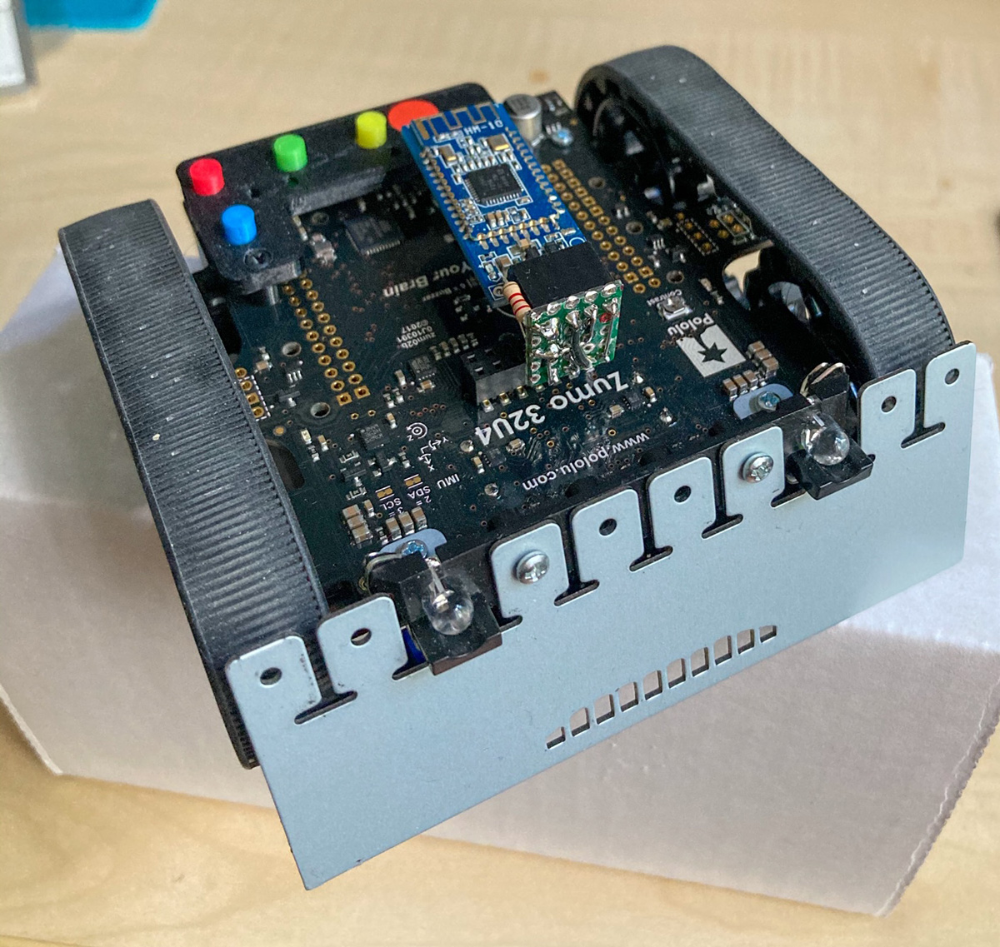
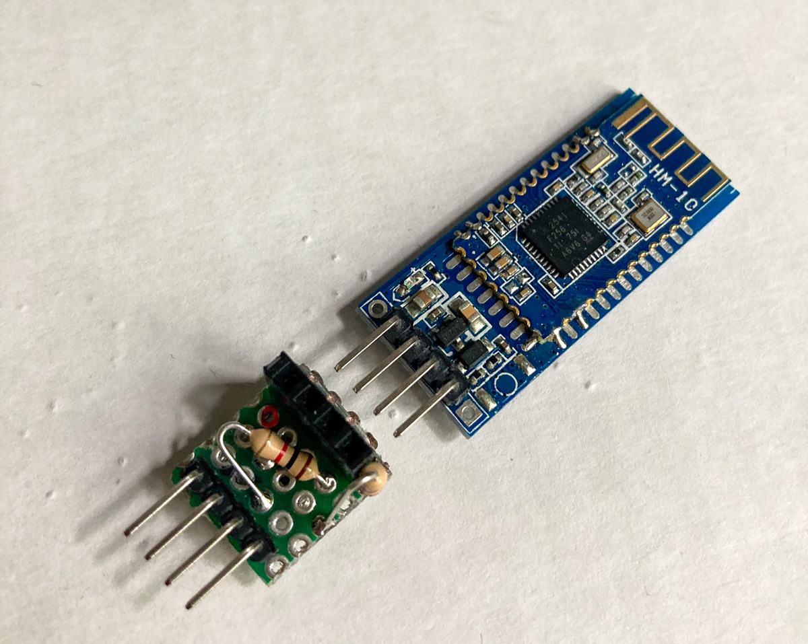

# Zumo32u4 - simple Bluetooth control

-   HM-10 VCC to +5V 
-   HM-10 TX pin to zumo RX
-   HM-10 RX pin to a voltage divider and then to zumo TX
-   HM-10 GND to GND

-   Send "fwd", "rev", "lft", "rgt" or "sensor" from an smartphone bluetooth terminal App like BLE-Terminal to control the robot.
-   "sensor" returns the current primity sensor values
-   the robot should automatically stop before obstacles.
-   encoders are used for correction of different motorspeeds

Zumo with HM-10

adapterboard with voltage devider

